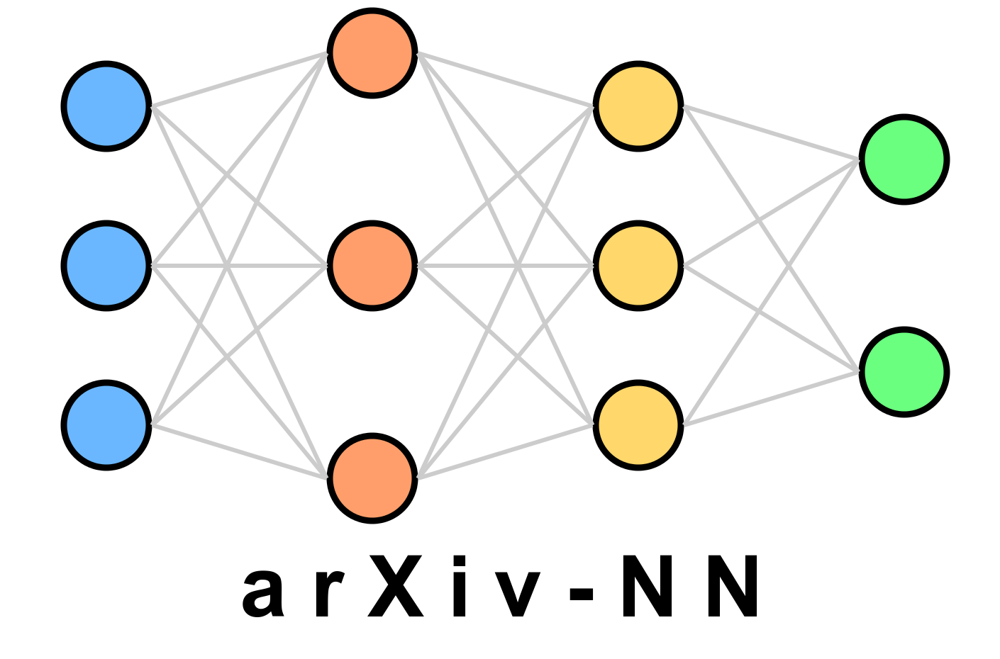

<div align="center">
  <br>
  
  <br>
</div>

**arxiv-NN** is a simple neural network classifier of arXiv's new submissions
(e.g.: https://arxiv.org/list/astro-ph/new).

# TODO

- [ ] Run as application, not script
- [ ] Allow no input file (create one from scratch)
- [ ] Use rich print for better visualization


Usage:

1. Generate a file called `labels_text.csv ` with two columns named 'label' and
   'text' with as many rows as desired. The first column stores the labels
   from 1 to `num_classes`, the second one stores the text
2. Define the `categ` and `subcategs` arguments as desired
3. Run the code


Example of `labels_text.csv ` file:

```
label,text
1,"The effects of climate change on coral reef ecosystems were studied over a 10-year period. Results indicate a 15% decline in biodiversity and a 30% reduction in coral cover, correlated with rising sea temperatures and increased ocean acidification."
2,"A novel approach to quantum computing using superconducting qubits demonstrated a 99.9% fidelity in two-qubit gates. This breakthrough paves the way for scalable quantum processors capable of solving complex optimization problems."
3,"Genetic analysis of ancient human remains from Eurasia revealed previously unknown migration patterns dating back 40,000 years. The study suggests a more complex interbreeding scenario between Homo sapiens and Neanderthals than previously thought."
4,"A new drug targeting the KRAS gene mutation showed promising results in phase III clinical trials for non-small cell lung cancer. Patients exhibited a 35% reduction in tumor size and a significant increase in progression-free survival rates."
1,"Advancements in CRISPR-Cas9 gene editing techniques have enabled the successful modification of photosynthetic pathways in C3 plants, potentially increasing crop yields by up to 40% under optimal conditions."
2,"The discovery of a new exoplanet within the habitable zone of a nearby red dwarf star has excited astrobiologists. Initial spectroscopic analysis suggests the presence of water vapor in its atmosphere, warranting further investigation."
3,"A long-term study on the effects of meditation on brain plasticity revealed significant increases in gray matter density in regions associated with learning, memory, and emotional regulation after 8 weeks of daily practice."
4,"Researchers have developed a new type of biodegradable plastic derived from algae that decomposes completely within 6 months in marine environments, potentially offering a solution to ocean plastic pollution."
2,"A groundbreaking experiment in particle physics has provided strong evidence for the existence of axioms, hypothetical particles that could explain the nature of dark matter and solve the strong CP problem in quantum chromodynamics."
3,"A comprehensive meta-analysis of global forest carbon sequestration rates indicates that reforestation and improved forest management could offset up to 25% of current annual carbon emissions, highlighting the importance of forest conservation in climate change mitigation strategies."
```

Each new submission in `categ` that matches any of the sub-categories in `subcategs`
will be assigned a label according to the trained NN. The user will be presented
with the classification for each new submission and asked to either:

1. store a new entry with the assigned label (by pressing `Return`)
2. store it with a different label (a number from 1 to `num_classes`, in case the NN
    miss-classified it)
3. continue without storing the entry (pressing `c`), or
4. quitting the code (pressing `q`)


